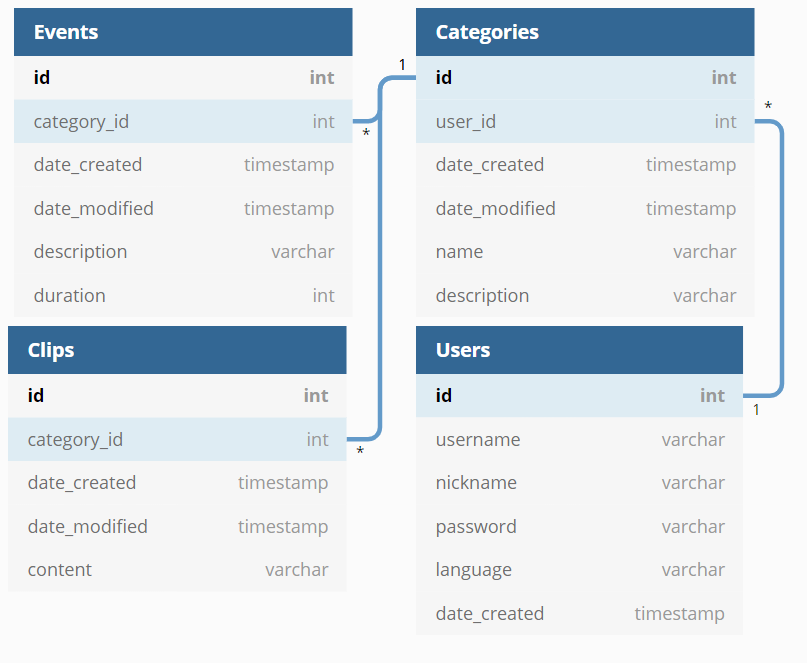

# Web-tietokantasovellus Keiji
Sovelluksen nimi tulee japaninkielisestä sanasta 計時, joka tarkoittaa _ottaa aikaa_. Se on suunniteltu kielten opiskelun kannalta. Sovellus löytyy osoitteesta: https://keiji-tsoha2020.herokuapp.com

## Mitä sillä voi tehdä?
 * Luoda oman tunnuksen (käyttäjänimi, email, salasana, kielivalinta jne)
 * Luoda kategorioita tapahtumille (esm. lukeminen, YouTube-videoiden katselu, podcastin kuuntelu)
 * Kirjata tapahtumia ajan kanssa (esm. kauanko kirjaa tuli luettua)
 * Luoda muistiinpanoja (esm. hyviä otteita kirjoista, Twitteristä jne.)
 * Katsoa ajankäytön kohdekielen parissa valitulla ajanjaksolla (yleinen tilastosivu)

## Tietokantakaavio
**Categories** eli kategoriat, **Events** eli tapahtumat, **Clips** eli muistiinpanot tai tekstiklipit ja **Users** eli käyttäjät. **Primary keyt** ovat lihavoitu ja **foreign keyt** ovat merkitty _id liitteellä. 

## Riippuvuudet
 * Python 3 (>= Python 3.5)
 * requirements.txt
