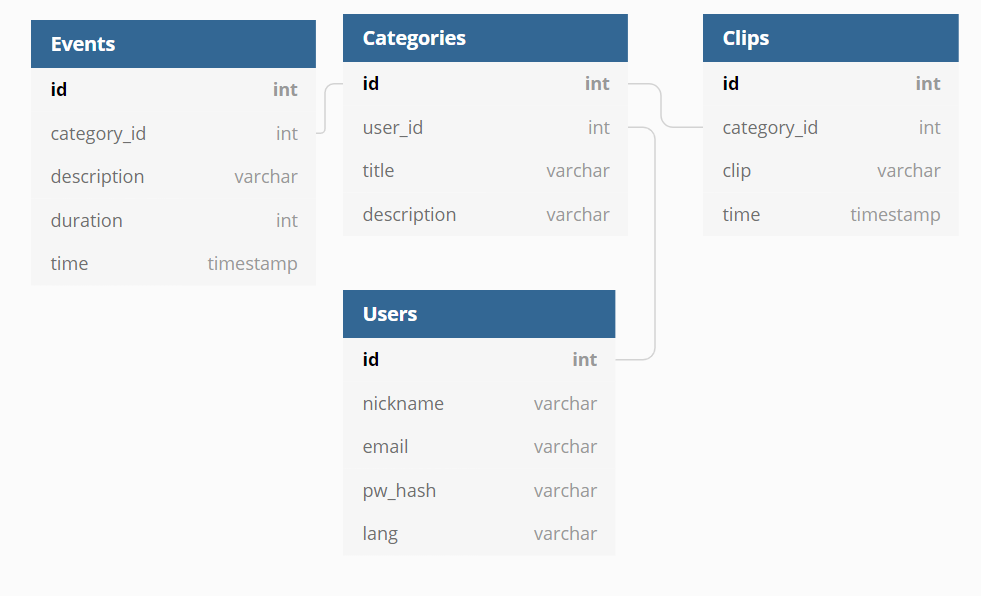

# Web-tietokantasovellus Keiji
Sovelluksen nimi tulee japaninkielisestä sanasta 計時, joka tarkoittaa _ottaa aikaa_. Se on suunniteltu kielten opiskelun kannalta. 

## Mitä sillä voi tehdä?
 * Luoda oman tunnuksen (käyttäjänimi, email, salasana, kielivalinta jne)
 * Luoda kategorioita tapahtumille (esm. lukeminen, YouTube-videoiden katselu, podcastin kuuntelu)
 * Kirjata tapahtumia ajan kanssa (esm. paljon tuli luettua kirjaa äsken)
 * Luoda muistiinpanoja (esm. hyviä otteita kirjoista, Twitteristä jne.)
 * Katsoa paljon on käyttänyt aikaa kohdekielen parissa valitulla ajanjaksolla (yleinen tilastosivu)

## Tietokantakaavio

## Riippuvuudet
 * Python 3 (>= Python 3.5)
 * requirements.txt (tulossa)
