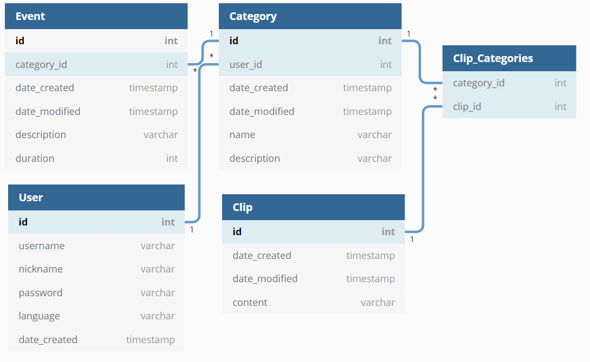

# Tietokanta
### Tietokantakaavio
**Categories** eli kategoriat, **Events** eli tapahtumat, **Clips** eli muistiinpanot tai tekstiklipit ja **Users** eli käyttäjät. **Primary keyt** ovat lihavoitu ja **foreign keyt** ovat merkitty _id liitteellä. 



### CREATE TABLE -lauseet

```
CREATE TABLE User (
    id INTEGER PRIMARY KEY, 
    username VARCHAR(32) UNIQUE NOT NULL, 
    nickname VARCHAR(16) NOT NULL, 
    password VARCHAR(256) NOT NULL, 
    language VARCHAR(2) NOT NULL, 
    date_created TIMESTAMP NOT NULL
)

CREATE TABLE Category (
    id INTEGER PRIMARY KEY, 
    user_id INTEGER NOT NULL, 
    date_created TIMESTAMP NOT NULL, 
    date_modified TIMESTAMP NOT NULL, 
    name VARCHAR(64) NOT NULL, 
    description VARCHAR(1024) NOT NULL, 
    FOREIGN KEY(user_id) REFERENCES User(id)
)

CREATE TABLE Event (
    id INTEGER PRIMARY KEY, 
    category_id INTEGER NOT NULL, 
    date_created TIMESTAMP NOT NULL, 
    date_modified TIMESTAMP NOT NULL, 
    description VARCHAR(2048), 
    duration INTEGER NOT NULL, 
    FOREIGN KEY(category_id) REFERENCES Category(id)
)

CREATE TABLE Clip (
    id INTEGER PRIMARY KEY, 
    category_id INTEGER NOT NULL, 
    date_created TIMESTAMP NOT NULL, 
    date_modified TIMESTAMP NOT NULL, 
    content VARCHAR(4096) NOT NULL, 
    FOREIGN KEY(category_id) REFERENCES Category(id)
)
```